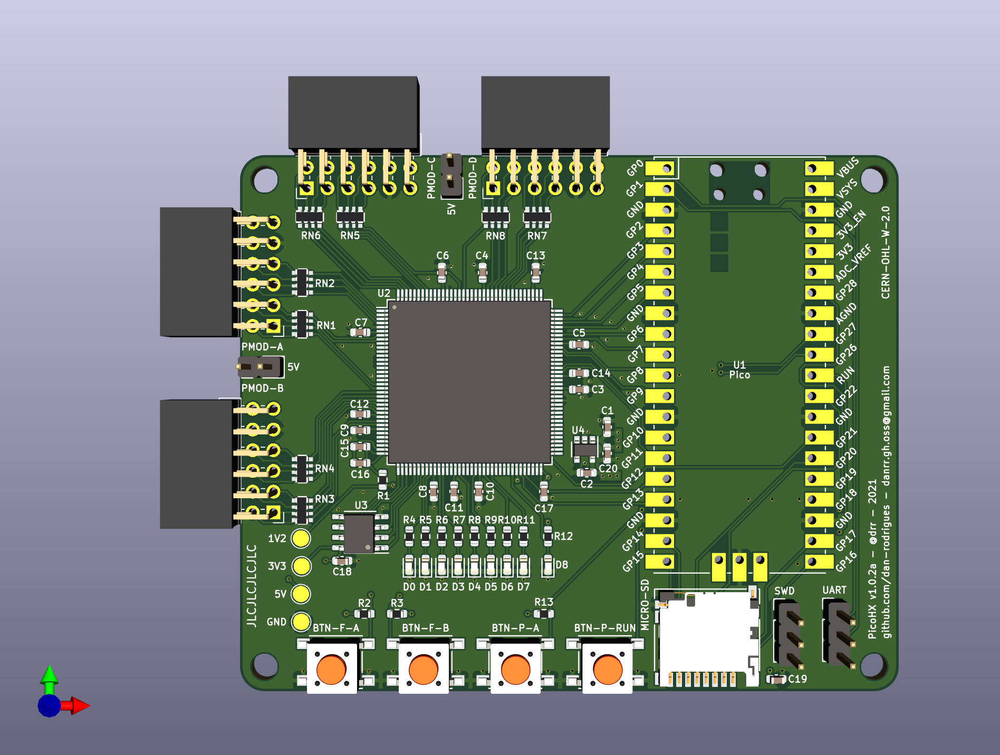

# PicoHX

This is an FPGA board that combines an iCE40 HX FPGA with the Raspberry Pi Pico. The Pico can program the FPGA over USB using a script included in this repo and then interact with it using GPIO.

## KiCad rendering



## DVI Demo

Pictured is an included DVI demo. First, the RP2040 was programmed with the USB software which then exposes a USB programmer device to the host. Then, the FPGA configuration containing the DVI test pattern config was uploaded from the host to the RP2040, which then programmed the FPGA, which then displayed the test pattern on screen. [This DVI PMOD](https://1bitsquared.com/collections/fpga/products/pmod-digital-video-interface) was used.


## Features

* iCE40 HX FPGA (TQFP144, 1k pinout assumed)
* 10 Pico GPIOs connected to FPGA
    * 2 are connected to `GBIN` inputs
* 4x PMODs in a 2x double-PMOD arrangement
* 8x user LEDs for FPGA
* 1x CDONE LED
* 2x users buttons for FPGA
* 1x user button for Pico
* `RUN` button for Pico
* Headers for Pico SWD and hardware UART
* Footprint for QSPI PSRAM or flash
* Micro SD card slot

## Design

### Programming

All iCE40 configuration pins are routed to the RP2040 GPIO so the details of how or when it is programmed are up to the software. The included software in this repo will make the Pico present itself is a USB device with these interfaces:

* Vendor programmer interface: This is how the user can program the iCE40 at any time over USB, using the included [picoprog.py](scripts/picoprog.py) script.
* CDC UART: This UART is separate to the hardware UART that is available on the dedicated pin header. By default, `stdout` is sent to the CDC UART for convenience.

### FPGA clock

The pico exposes one pin that can directly output a clock from one of its PLLs with an optional divider. In the demo software, the USB PLL (48MHz) is divided by 4 to output a 12MHz clock for the FPGA. On the FPGA side, the `GBIN5` pin is used for clock input so that the  `SB_PLL40_2F_PAD` can be used.

### Power

There is only a 1.2v regulator on the board as the Pico provides a 3.3v output. The `2V5_VPP` input is tied to 3.3v as the NVCM isn't used in this project.

### PIO support

The 10 GPIOs connected to the FPGA and 4 GPIOs connected to the SD card slot are in consecutive order, so PIO can be used.

## Demo

A demo that displays several test patterns controlled by BTN-A and blinks the LEDs in succession can be found in [rtl/demo](rtl/demo).

```
cd rtl/demo
make prog
```
 
## Usage

### Building Pico software

It's assumed that the [pico-sdk](https://github.com/raspberrypi/pico-sdk) is installed and the required environment variables are set.
Since there's continuous development on pico-sdk, it's not guaranteed this version of the pico software will compile with the newest version of the sdk.
For now we will work with pico-sdk version 1.1.2. Be sure to also checkout pico-sdk's submodules in the state as of v1.1.2:

```
# get the pico-sdk sources, save in a path of your liking
git clone https://github.com/raspberrypi/pico-sdk

cd pico-sdk
git checkout afc10f3 # version 1.1.2
git submodule init
git submodule update
```

Now we can compile our software:

```
cd software
mkdir build
# adapt the following path export to your system
export PICO_SDK_PATH=/path/where/you/cloned/pico-sdk/
cd build
cmake ..
make
```

The software can then be flashed using `picotool` for example.

Alternatively you can use the built-in mass storage emulation for programming your pico.
Hold down the BOOTSEL button on the pico while plugging in the USB cable. The pico will be mounted like a USB stick on your computer. After successful compilation, copy the software/build/picohx_demo.uf2 file onto the emulated drive. As soon as the file is copied, the pico will execute the new firmware. 

Default behaviour of the software is to immediately flash the iCE40 with an included bitstream that runs a counter with output to the 8 user LEDs.

### Programming iCE40 bitstream

It's assumed that the OSS FPGA toolchain is installed which includes [yosys](https://github.com/YosysHQ/yosys) and [nextpnr-ice40](https://github.com/YosysHQ/nextpnr).

After the Pico software is flashed, it's ready to program the iCE40 using a custom USB driver script. The script is written in Python3 and requires [pyusb](https://github.com/pyusb/pyusb).

```
pip3 install pyusb
```

It can then be programmed with similar usage to [iceprog](https://github.com/YosysHQ/icestorm/tree/master/iceprog). The programmer script is [picoprog.py](scripts/picoprog.py).

```
./picoprog.py bitstream.bit
```
 
